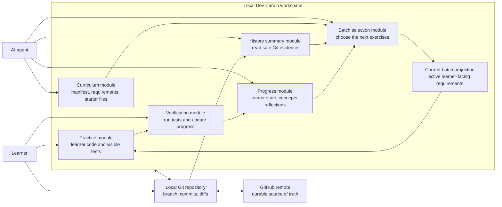
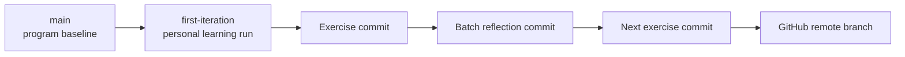
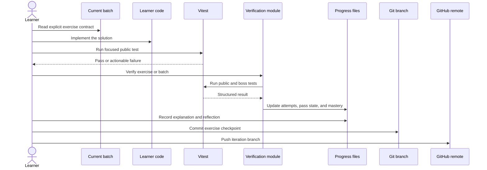
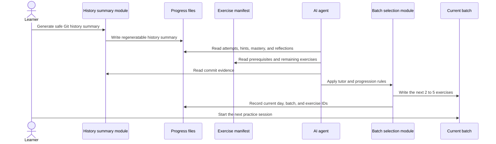

# Dev Cardio System Design

## 1. Scope

This document describes the current personal Dev Cardio workflow.

Dev Cardio is a local-first, GitHub-backed learning system for one learner completing exactly 50 exercises across five days. The learner writes and runs code locally. Git records the state and history. GitHub stores the durable remote copy. An AI agent reads the repository and Git evidence to help select the next batch without writing the learner's implementation.

This design does not cover multiple users, a hosted web application, real-time collaboration, subscriptions, or a separate database.

## 2. Core Design Decision

The repository, its branches, and its commit history are the persistence system.

The reason is practical and personal:

> I do not want to spend time designing and operating a database, hosting a backend, managing authentication, or building extra infrastructure just to track each learning iteration. An AI agent can already read repository files and Git history. A branch can hold one complete Dev Cardio iteration, so GitHub can be both the durable store and the source of truth.

This is not a claim that GitHub is better than a database for every application. It is a deliberate fit for a single-person, repository-centered workflow where the data is mostly code, tests, Markdown, JSON, and commit history.

## 3. Goals

- Keep the five-day, 50-exercise program fully inside one repository.
- Let each branch represent an independent learning iteration.
- Keep exercise definitions, learner code, tests, progress, and reflections together.
- Give the AI agent enough evidence to adapt the next batch.
- Preserve a complete, inspectable history through commits and diffs.
- Avoid a hosted backend, database server, migrations, authentication system, and administrative dashboard.
- Keep the learner's implementation under the learner's control.

## 4. Non-Goals

- Supporting multiple learners in the same branch.
- Accepting concurrent writes from several devices or agents.
- Querying progress across thousands of users.
- Recording high-frequency telemetry.
- Replacing GitHub with a general-purpose relational database.
- Letting the AI agent solve unfinished exercises.

## 5. Architecture Overview

The system runs locally. GitHub does not execute the learning loop. It stores the branch and commit graph so the current state can be recovered, inspected, and read by an AI agent with repository access.

## 6. Module Interfaces

The architecture uses a few deep modules with narrow interfaces. Each module hides its file parsing, validation, and update logic from its caller.

| Module | Interface | Responsibility |
|---|---|---|
| Curriculum | `exercises/manifest.json` and the current batch | Defines all 50 exercises, requirements, prerequisites, levels, tests, and completion metadata |
| Practice | Starter file plus visible test files | Presents one exercise and evaluates observable behavior without exposing a solution |
| Verification | `npm run cardio:verify` | Resolves exercise IDs, runs public and boss tests, and updates recorded results |
| Progress | `learner-state.json`, `concepts.json`, and `reflections.md` | Stores the current materialized learning state |
| History summary | `npm run cardio:history` | Converts Git history into safe evidence without treating commit gaps as active work time |
| Batch selection | `npm run cardio:next` plus the AI tutor contract | Selects the next prerequisite-safe batch from progress, mastery, and Git evidence |
| Git persistence | Git commands and the checked-out branch | Versions every repository state and records immutable checkpoints |
| GitHub persistence adapter | Push, pull, clone, and remote branch storage | Stores and synchronizes the repository without a custom backend |

The important seam is between learning logic and persistence. Learning modules read and write normal repository files. Git versions those files. GitHub stores the Git objects remotely. No learning module needs a database client.

## 7. Git and GitHub as the Data Model

A branch is not a database table. Technically, a branch is a movable reference to a commit. That commit identifies a complete repository snapshot and its parent history. In this design, that model is enough to represent one learning iteration.

| Database concept | Dev Cardio equivalent |
|---|---|
| Database instance | GitHub repository |
| Independent learner run | Git branch |
| Current database snapshot | The commit referenced by branch `HEAD` |
| Uncommitted transaction | Working tree changes |
| Committed transaction | Git commit |
| Record history | Commit history and diffs |
| Schema | TypeScript types, JSON shapes, and repository conventions |
| Constraints | TypeScript checking, Vitest tests, and verification rules |
| Materialized view | Progress JSON, current batch Markdown, and history summary JSON |
| Backup and synchronization | GitHub remote branch |
| Audit query | `git log`, `git show`, and `git diff` |
| Rollback checkpoint | A previous commit |

### Branch convention

One branch represents one Dev Cardio iteration. The current iteration is stored on `first-iteration`.

The branch contains both the current state and the complete path used to reach it. A later iteration can start from the program baseline without erasing the evidence from the earlier branch.

### Single-writer rule

Only one active learner or agent workflow should write to an iteration branch at a time. This keeps file updates and commits serial. Git can merge concurrent work, but progress-state JSON is not designed as a conflict-free multi-writer store.

## 8. Source-of-Truth Rules

GitHub stores the durable branch, but individual files have different authority inside a branch snapshot.

| Information | Authoritative source | Notes |
|---|---|---|
| Exercise definitions | `exercises/manifest.json` | Defines requirements, level, concepts, prerequisites, files, and completion metadata |
| Active batch | `exercises/current-batch.md` | Learner-facing projection of the currently selected exercises |
| Exercise implementation | `src/exercises`, `src/components`, and `src/hooks` | Written by the learner |
| Observable behavior | `tests/public` and unlocked `tests/boss` | Tests must agree with the manifest contract |
| Current per-exercise state | `progress/learner-state.json` | Preferred over duplicated completion fields when the application evaluates progress |
| Concept mastery | `progress/concepts.json` | Updated after verification |
| Learner reasoning | `progress/reflections.md` | Human-authored evidence that passing tests are understood |
| Historical evidence | Git commits and diffs | Used as supporting evidence, never as the only mastery signal |
| Safe Git projection | `progress/history-summary.json` | Derived and regeneratable |

If a derived file is lost, it should be regenerated from its authoritative inputs. If two authoritative files disagree, the inconsistency must be resolved before generating the next batch.

## 9. Exercise Completion Flow

A test pass is not enough for completion. The exercise also needs the required explanation, learner-authored test when specified, and commit checkpoint.

## 10. Adaptive Batch Flow

### Selection inputs

- public and boss test results;
- number of attempts;
- strongest hint used;
- explanation status;
- learner-authored tests;
- concept mastery and regressions;
- recorded active minutes when explicitly available;
- safe commit metadata;
- prerequisites and the fixed five-day progression.

### Selection output

The output is a batch of 2 to 5 exercises that keeps the daily total at 10 and the full program at 50. The batch should contain a confidence builder, current-level work, spaced review, and composition when readiness allows.

### Important restriction

Commit timestamps are not treated as active learning time. A long gap may represent sleep or work, while a short gap may include copied code. Git history supports the decision, but tests, explanations, hints, and delayed reuse are stronger evidence.

## 11. Consistency Model

The checked-out working tree is mutable. A commit is the atomic learning checkpoint.

The verification module currently updates several JSON files. A process interruption could leave uncommitted files partially updated. The workflow handles this by:

1. keeping all updates visible in the working tree;
2. reviewing the diff before committing;
3. rerunning verification when an update was interrupted;
4. committing only a coherent state;
5. pushing the completed checkpoint to GitHub.

GitHub becomes the durable source of truth only after the branch is pushed. Local uncommitted changes remain the active transaction until they are committed.

## 12. AI Agent Access Rules

The AI agent may read:

- the checked-out branch;
- exercise definitions and tests;
- progress and concept files;
- reflections;
- safe Git history summaries;
- Git status and diffs needed to understand the current iteration.

Before an exercise is complete, the AI agent must not:

- implement the learner's solution;
- reveal hidden test inputs;
- weaken a valid test;
- treat a commit as proof of understanding;
- combine progress from another branch unless the learner explicitly requests it;
- silently commit or push changes.

The learner remains the only authority for committing the exercise implementation.

## 13. Failure and Recovery

| Failure | Recovery |
|---|---|
| A test fails | Keep the working tree, inspect the failing contract, and continue the exercise |
| Verification is interrupted | Review the JSON diff and rerun verification before committing |
| Batch generation produces poor exercises | Reject the uncommitted batch or revise it before creating a checkpoint |
| An incorrect state was committed | Create a corrective commit or intentionally revert the specific checkpoint |
| Local files are lost | Clone the repository and check out the iteration branch from GitHub |
| GitHub is temporarily unavailable | Continue locally and push after connectivity returns |
| Two devices edit the same progress files | Stop and reconcile the branch before continuing the learning loop |

## 14. Why a Database Is Not Needed Here

For this workflow, a database would add more interfaces than useful behavior.

A database-backed version would need at least:

- a database schema and migrations;
- a backend process or hosted data interface;
- authentication and credentials;
- backup and restore decisions;
- synchronization between repository code and stored progress;
- an administrative way to inspect or repair data;
- an additional interface for the AI agent to access the data.

Git and GitHub already provide the capabilities this personal workflow needs:

- versioned snapshots;
- branch isolation for separate iterations;
- immutable history;
- readable diffs;
- local-first operation;
- remote durability;
- direct access for repository-aware AI agents;
- code, tests, progress, and reflections in one place.

The main tradeoff is that Git is optimized for versioned files, not arbitrary queries or concurrent structured writes. That tradeoff is acceptable because this system has one learner, one active iteration branch, a small fixed dataset, and a commit-oriented workflow.

## 15. Limits of the Design

This design would stop fitting if Dev Cardio needed:

- many learners writing at the same time;
- cross-user reporting and aggregation;
- real-time progress updates;
- granular server-side permissions;
- high-frequency events;
- large datasets that cannot be reviewed comfortably as files;
- transactions spanning independent repositories or external systems.

Those are not current requirements. Adding infrastructure for them now would create management work without helping the current personal learning loop.

## 16. System Invariants

1. The program always contains exactly 50 exercises across five days.
2. One branch represents one learning iteration.
3. The checked-out iteration branch is the only progress context used for generation.
4. Tests and published requirements must describe the same observable behavior.
5. The learner writes the implementation.
6. AI may clarify, review, and adapt, but may not solve an unfinished exercise.
7. Passing tests require an explanation before an exercise is complete.
8. Git history is supporting evidence, not the sole mastery signal.
9. Derived summaries can be regenerated from authoritative files and Git history.
10. The learner reviews and creates commits. Automation does not silently commit or push.

## 17. Related Documents

- [`README.md`](../README.md): personal motivation and daily usage
- [`PROGRAM_SPEC.md`](PROGRAM_SPEC.md): curriculum, test rules, and AI tutor contract
- [`exercises/current-batch.md`](../exercises/current-batch.md): active learner-facing batch
- [`progress/reflections.md`](../progress/reflections.md): learner explanations and review notes
